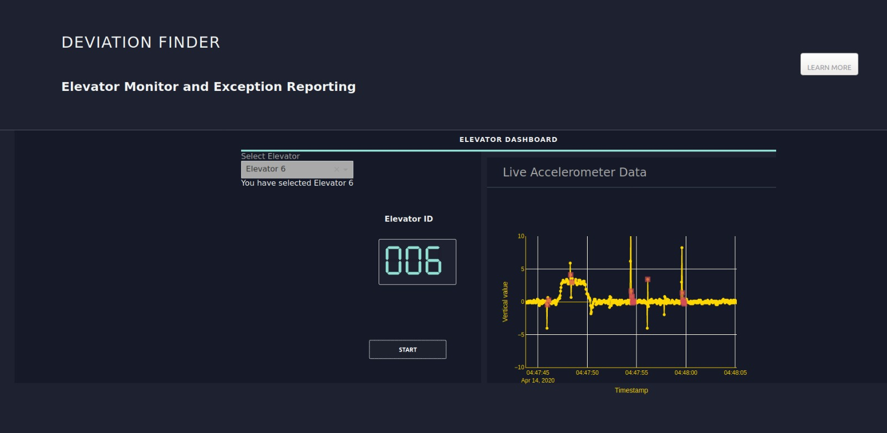

# Deviation Finder
#### Created by Ria Thomas, Vipin Das, Varnnitha Venugopal, Kenny Tony Chakola, Keerthi Ningegowda in association with Technical Safety BC. 
## An Elevator Anomaly Detection System

The project aimed at designing a system that could collect accelerometer data from elevators and identify anomalies which can then be used to predict which elevators are potentially at-risk of technical issues related to elevator brakes, motor and alignment.

## About the dataset

We had access to around 75 GB of accelerometer data from 15 lifts which was provided by Technical Safety BC. Data collected from the accelerometer was formatted as a csv file with rows representing recordings at each timepoint. 4 columns were included in every file as given below:

 - Timestamp
 - Acceleration - X axis
 - Acceleration - Y axis
 - Acceleration - Z axis

One of the axes denotes vertical movement whereas the other two represents the horizontal movement. The input data was filtered to use data from 2018-07-09 to 2018-08-09. The sign of acceleration values were flipped for a negative vertical axis.
Z-normalization and moving average low-pass filter is applied to remove any structural dissimilarities and noise.

## How to test the code?

Please follow the below steps to host the streaming anomaly detection system in localhost. A sample screenshot of the dashboard is given below.
A sample video of the Deviation finder dashboard is added in the folder Deployment setup > Visual for reference.



### Amazon DynamoDb setup

The first step in deployment stage is to set up Amazon DynamoDB locally and create tables to store and process streaming data.

1. You can follow the steps in the given link to setup Amazon DynamoDB : https://docs.aws.amazon.com/amazondynamodb/latest/developerguide/DynamoDBLocal.DownloadingAndRunning.html 
   
   You will also require the AWS CLI to create tables. Please refer to this link to set it up in your system : https://docs.aws.amazon.com/polly/latest/dg/setup-aws-cli.html.

2. Once the DynamoDB and AWS CLI has been installed and set up locally, you should create 3 tables for data storing and processing. The format and fields required for these tables are in the folder DynamoDB. Run this command for three seperate tables with the respective json file names to create these tables.

```
  aws dynamodb create-table --cli-input-json file://create-table.json --endpoint-url http://localhost:8000
```  
3. To set the index field in the restart table to 0, you should run the loadrestart.py file once.

```
  python3 loadrestart.py
```
**Note** : You can use the deletetab.py code to delete the tables created in DynamoDB.

### Kafka setup

The second step in the deployment stage is to set up a Kafka cluster for simulating a real-time streaming environment.
 
4. Download and Install the Kafka server form this link : https://www.apache.org/dyn/closer.cgi?path=/kafka/2.5.0/kafka_2.12-2.5.0.tgz. Un-tar the file using the below command.

```
  tar -xzf kafka_2.12-2.5.0.tgz
  cd kafka_2.12-2.5.0
```
5. Once the Kafka Server is installed, lets start the Zookeeper and Kafka servers by running the below commands inside the installed directory in seperate terminals.

```
  bin/zookeeper-server-start.sh config/zookeeper.properties
  bin/kafka-server-start.sh config/server.properties
```
6. This starts the Zookeeper and Kafka serves and the next step is to create topics. You should create 15 topics, each corresponding to 15 elevators. You should name the topics in the format : Lift<number> (eg: Lift1, Lift 12, etc). You can create topics in Kafka by running the below command with the respective topic name in place of <topic_name>.
  
```
  bin/kafka-topics.sh --create --bootstrap-server localhost:9092 --replication-factor 1 --partitions 1 --topic <topic_name>
```
7. Once the topics are created, you can start running the producers to produce data to the these topics. Go to the producers folder inside the Streaming Setup and run the 15 producer.py files to start the 15 producers. Please note that these codes make use of Apache Spark. Please ensure that you have Spark installed and has set up Spark in your environment. You can use the below commands to run the producers once you have set up spark environment variable.

```
  ${SPARK_HOME}/bin/spark-submit Lift1_producer.py
```  
8. Once you have run the 15 producer codes, data would be produced into these topics, Now, you have to create consumers to consume the data from these topics and store to the Input table in the Amazon DynamoDB created earlier. For this, go to the Consumers folder and run the 15 consumer.py codes to start the consumers. These codes also makes use of Apache Spark.
  
```
  ${SPARK_HOME}/bin/spark-submit --packages org.apache.spark:spark-sql-kafka-0-10_2.11:2.4.4 Lift1_consumer.py
```   
After completing these steps, the data would be produced into the Kafka topics by producers in one end and at the other end, these data would be consumed by consumers and stored into the input table. This completes the Kafka setup.

**Note**: For detailed refrenece on how to install and set up Kafka server, you can follow steps given in this link : https://kafka.apache.org/quickstart.


### CronTab setup

Now we should start a cron job to run the predictions on the streaming data in an interval of 5 minutes and store it to the Elevator table.

9. For this you need to have the Python-crontab installed. You can install this using the below command.

```
  pip install python-crontab
```  
10. Once the Python-crontab is installed, you should run the cron_setup.py file to create new crontab job that would run the prediction.py file inside the Predictions folder that does the prediction of streaming data in the background in an interval of 5 minutes.
  
```
  python3 cron_setup.py
```

### Flask setup

The final step in the deployment stage is to start a dashboard to plot the predictions made on the streaming data. We make use of Flask web framework and Plotly Dash for this. We setup this instance in a Python3 virtual environment.

11. Install the Python3 Virtual environment by running the below command and activate that environment.
  
```
  sudo apt-get install python3-venv
  python3 -m venv env
  source env/bin/activate
```  
12. Install all the required packages using pip install.
```
  pip install flask
  pip install dash
  pip install plotly
  pip install pandas
  pip install dash_daq
  pip install boto3
  pip install json
```
13. Finally set the FLASK_APP variable and run the flask engine to start the web server.

```
   export FLASK_APP=app.py
   flask run
```
At this point, the web interface should be up and running, and you should be able to see the dashboard at the indicated hyperlink.


### Miscellaneous
To test the code related to feature engineering using TSFRESH, please execute the .ipynb file in 'Feature Engineering' folder.

To test individual machine learning models, please follow the below steps in the folder Machine Learning. The models are already trained and saved in the folder 'Models'.
- For LSTM Autoencoders, ANN Autoencoders, Standard Anomaly Detection and Isolation Forest, please execute the corresponding .ipynb files
- For Kmeans, please execute the below command
```
spark-submit kmeanslift1.py
```

## Folder structure

### EDA
The folder contains exploratory data analysis details for all the 15 lifts. 
The code consists of pre-processing of the accelerometer data and plotting data for different ranges to get an idea of how anomalies and normal patterns look like.

### Feature Engineering
Code using TSFRESH which was used to generate new features to improve model accuracy. This method was explored as acceleration value was the only relevant feature provided.

### Machine Learning
Code for all the machine learning algorithms used as part of the project. This contains training and sample prediction of each model on the input data. The below algorithms were experimented with -

- Standard Anomaly Detection
- Isolation Forest
- K-means
- ANN Autoencoders
- LSTM Autoencoders

### Models
Saved models for the machine learning algorithms used.

### Prediction samples
Screenshots of anomaly detection by using a sample data on all the 5 machine learning algorithms. The blue line represents the actual signal whereas the red points denote the anomalies detected by each model.

### Evaluation metrics
 Details of evaluation for machine learning models. As the input data was not labelled, a subset of data was manually labelled. The same dataset was used by all the models for prediction and F1-score was calculated. The model with maximum F1-score was selected. 
  
### Deployment Setups
This folder consists of details of setting up the real-time streaming system using Amazon Dynamo DB and method to plug in the machine learning model (LSTM Autoencoder) for predictions. 

